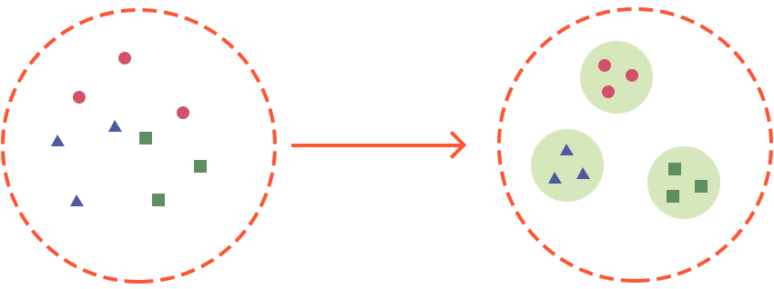
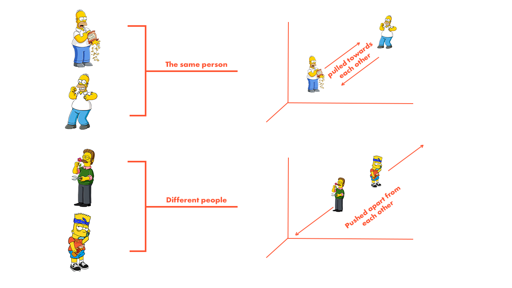
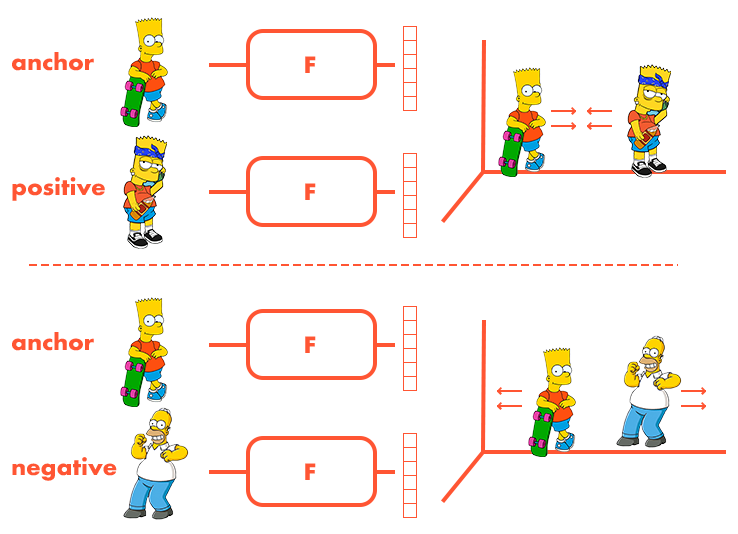

# Face-ID: Triplet-Loss

All doors are equipped with video cameras, so the company wants to implement a solution capable of recognizing the faces of people trying to "break in" to our office.
The company already has a photo of each employee and plans to manually mark additional frames with faces using the camera footage from the new office

### Classification
The dataset for the task is a set of frames with faces of people (1 person - 1 class). The dataset will also include an additional class - faces of people not employed by the company.

You might be thinking, why not just train a classifier on the dataset from the faces of employees?

For example, we can take a neural network whose output is a linear layer that predicts the probabilities of class membership.
Then run training using Cross Entropy, a generalization of the LogLoss loss function to multi-class classification.
The prediction of this model is one of class membership of a person.
Then you can put different degrees of protection for doors in the office (not every employee can go through all doors).

It looks very simple and clear!

But this approach has significant drawbacks:

1. There can be more than 1000 different people in our dataset. Standard classification methods start to work inadequately with so many classes.
2. Just a few (1 - 10) images per person.
3. The company will hire new employees - the number of classes will change. Then we will have to change the number of output neurons in the model.

###  Metric Learning

Let's recall the classical machine learning tasks:

Classification - the model returns class labels or probability of class membership.
Regression - the model returns a predicted real number.
And what does the model return in the Metric Learning task?

It returns a point in an N-dimensional space in which the distance between any two points can be measured, such
$$\text{Euclidean}(x_1, x_2) = \sqrt{\sum_{i=1}^{N} (x_{1,i} - x_{2,i})^2}$$

The Metric Learning task reduces to obtaining a model F that maps faces into a desired point space: frames belonging to the same people are close and different ones are far away.
The points in the resulting space are called embeddings, and the model F is an encoder that can be used to obtain embeddings.
An encoder is usually a component of a neural network that compresses raw data into smaller embeddings.

Embedding space transformation in the Metric Learning task. After training the model, similar objects are grouped into clusters.

Metric Learning embeddings are used in the following tasks:

Matching (product embeddings)
Recommender systems (product/user embeddings)
Search engines (embeddings of queries/documents for output)

Using the Metric Learning approach, you can solve the face recognition problem quite simply.
Let's display a new photo of a face in the embedding space and find 10 nearest neighbors (KNN algorithm) in this space for this photo.
Then we will consider the most popular person among the nearest neighbors as the person in the new photo.

### Contrastive learning
Contrastive Learning is a Metric Learning approach to learning based on measuring the distance between frames in space.

Intuitively, it can be described by two principles:

1. Minimize the distances between a pair of objects of the same class (one person).
2. Maximize the distances between a pair of objects of different classes (two different people).

## Contrastive loss: Numpy

We take a pair of faces from our dataset and get their embeddings $$\( x_1 \)$$ and $$\( x_2 \)$$, then $$\( D(x_1, x_2) \)$$ is the distance between points in space.

Embeddings of images of the same person (\( y = 1 \)) should be brought closer, and embeddings of different people (\( y = 0 \)) should be repelled.

Contrastive loss is defined by the following formula:

\[ L = y * D(x_1, x_2)^2 + (1 - y) * \max(\text{margin} - D(x_1, x_2), 0)^2 \]

The pros of this approach are simple generation of pairs of objects (mining). But it has a large number of disadvantages:

The quality of learning can strongly depend on the margin hyperparameter and the distance metric D(x1, x2). Requires a large size dataset.
Data quality and outliers can greatly affect model training.